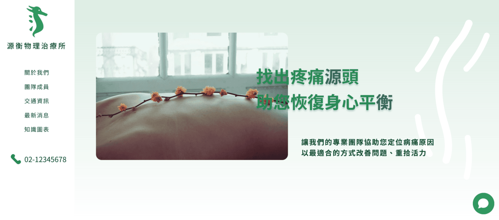

🌐 [>> 點此進入網站](https://pt-clinic.vercel.app/)
## 關於專案
這是一個假想的物理治療所網站。以簡潔、療癒、活潑而不失專業感的設計風格，希望打破傳統醫療主題網站較為制式、嚴肅的印象。

## 特色
- 自製符合主題的向量圖示與動畫
- 響應式設計
- 互動式閱覽衛教資訊
- AI 聊天機器人，提供訪客一對一問答

## 開發使用技術
- 框架：Next.js
- 樣式：SCSS / PostCSS
- 動畫：GSAP / Framer Motion / Lottie
- 資料庫：Firebase Cloud Firestore
- 地圖：Leaflet

## 功能導覽
- 治療所聯絡電話、營業時間等重要資訊常駐頁首與頁尾
- 首頁：快速瞭解治療所的目標、服務項目、就診流程與最新消息
- 關於我們：瞭解治療所成立源由、理念與特色
- 團隊成員：閱讀每位治療師的背景資訊
- 交通資訊：查看前往治療所的交通方式與地圖
- 最新消息：查看關於治療所的最新狀態、活動
- 知識圖表：使用者能根據自身狀況，點擊人體圖表查看對應的健康資訊
